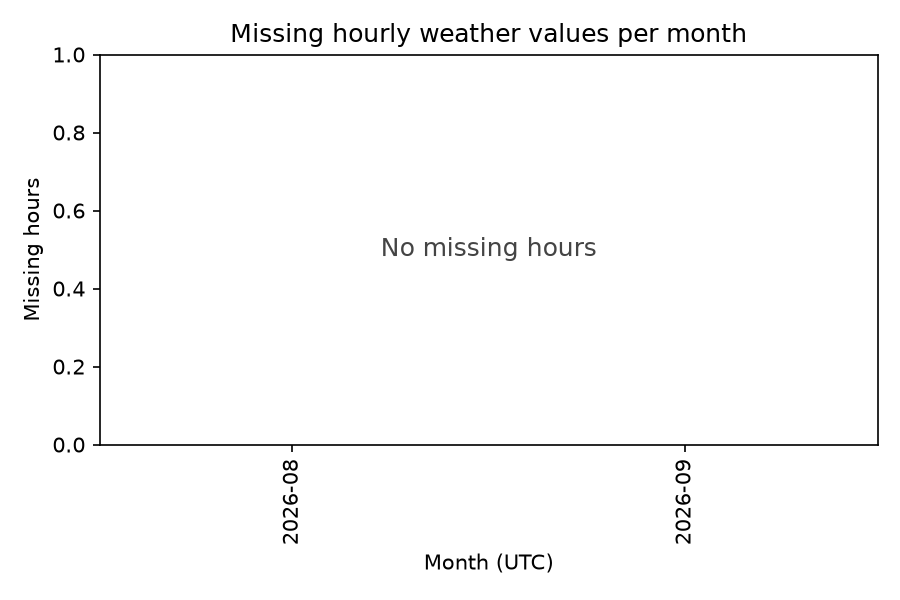

# Weather data quality (archive)

Generated by `ml/weather_quality.py`.

- Source: `archive` at (-0.7, 36.6)
- Covered: **2026-08-26 00:00 to 2026-09-24 23:00 UTC**
- Hourly values stored: **720** of 720 expected (100.0% coverage)
- Missing hours: **0**
- Local calendar days touched: 31 (29 whole days, excluding the partial day at each end)

## Days the Hutton rule can judge

A day needs at least 20 of 24 hourly values.

- Days with >= 20 values: **29 of 29 (100.0%)**
- Days with all 24 values: 29
- Days that cannot be judged: 0 (recorded as `insufficient_data`, never as low risk)

## Out-of-range values

Plausible ranges for this site: temperature -10.0 to 50.0 C, humidity 0.0 to 100.0%.

None. Every stored value is inside the plausible range.

## Missing hours per month

| Month (UTC) | Stored | Missing |
|---|---|---|
| 2026-08 | 144 | 0 |
| 2026-09 | 576 | 0 |

## How gaps are treated

Missing hours are left missing. Nothing is interpolated, because the Hutton rule counts hours above a humidity threshold, and invented hours would manufacture threshold crossings. A day below the 20-hour bar is stored with `status='insufficient_data'` and a NULL score, so it shows up as a gap in the farmer's history rather than as a calm day.
